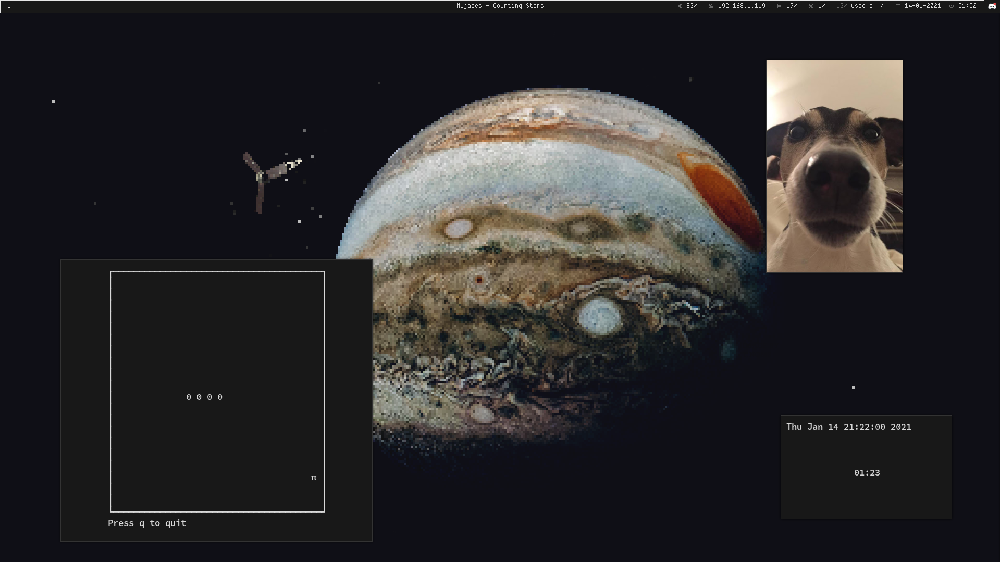
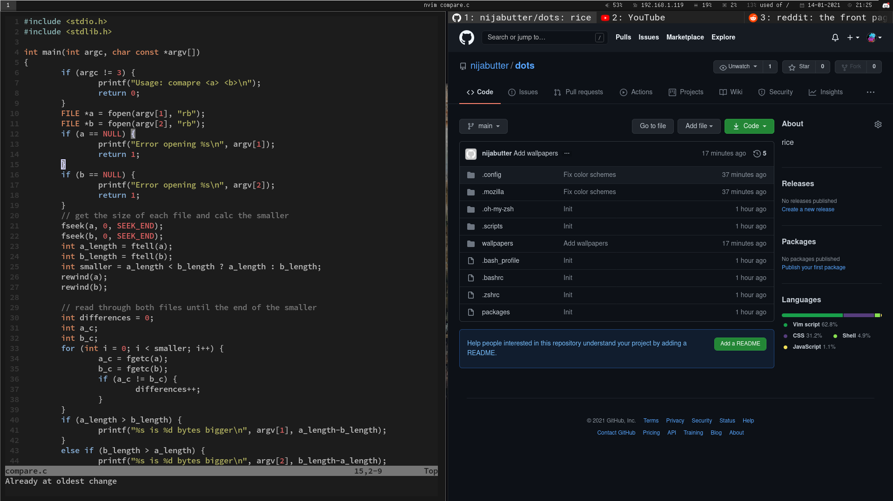

# dots

Arch linux rice

##### Installing things

- yay
`sudo pacman -S --needed git base-devel`

`git clone https://aur.archlinux.org/yay.git`

`cd yay`

`makepkg -si`

- neovim
`sudo pacman -S neovim`

- vim-plug
`sudo pacman -S yar`

`sh -c 'curl -fLo "${XDG_DATA_HOME:-$HOME/.local/share}"/nvim/site/autoload/plug.vim --create-dirs https://raw.githubusercontent.com/junegunn/vim-plug/master/plug.vim'`

- oh-my-zsh
`sh -c "$(curl -fsSL https://raw.githubusercontent.com/ohmyzsh/ohmyzsh/master/tools/install.sh)"`

- zsh-autosuggestions
`git clone https://github.com/zsh-users/zsh-autosuggestions ${ZSH_CUSTOM:-~/.oh-my-zsh/custom}/plugins/zsh-autosuggestions`

- zsh-syntax-highlighting
`git clone https://github.com/zsh-users/zsh-syntax-highlighting.git ${ZSH_CUSTOM:-~/.oh-my-zsh/custom}/plugins/zsh-syntax-highlighting`

